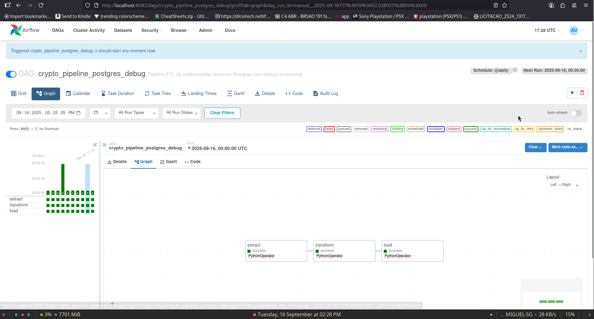

# Crypto Pipeline com Airflow e Postgres

Automação de pipeline ETL de dados de criptomoedas utilizando **Apache Airflow**, **Python**, **Docker** e **Postgres**.  
O projeto extrai dados da API CoinGecko, transforma e carrega em um banco Postgres, demonstrando aplicação prática de **DevOps, automação e manipulação de dados**.

---

## Tecnologias Utilizadas

- **Linguagem:** Python  
- **Orquestração:** Apache Airflow  
- **Banco de Dados:** PostgreSQL  
- **Containers:** Docker / Docker Compose  
- **Bibliotecas:** Pandas, Requests, SQLAlchemy, Airflow Providers  
- **Versionamento:** Git / GitHub  

---

## Objetivo do Projeto

- Demonstrar pipeline ETL completo: **Extração → Transformação → Carga**  
- Coletar dados de criptomoedas (Bitcoin, Ethereum e Cardano) via API  
- Transformar dados para cálculo de métricas adicionais (`price_change_ratio`, `is_profitable`)  
- Armazenar resultados em uma tabela Postgres de forma automatizada  
- Praticar **automação, containers e uso avançado de Linux**  

---

## Demonstracao do projeto rodando

